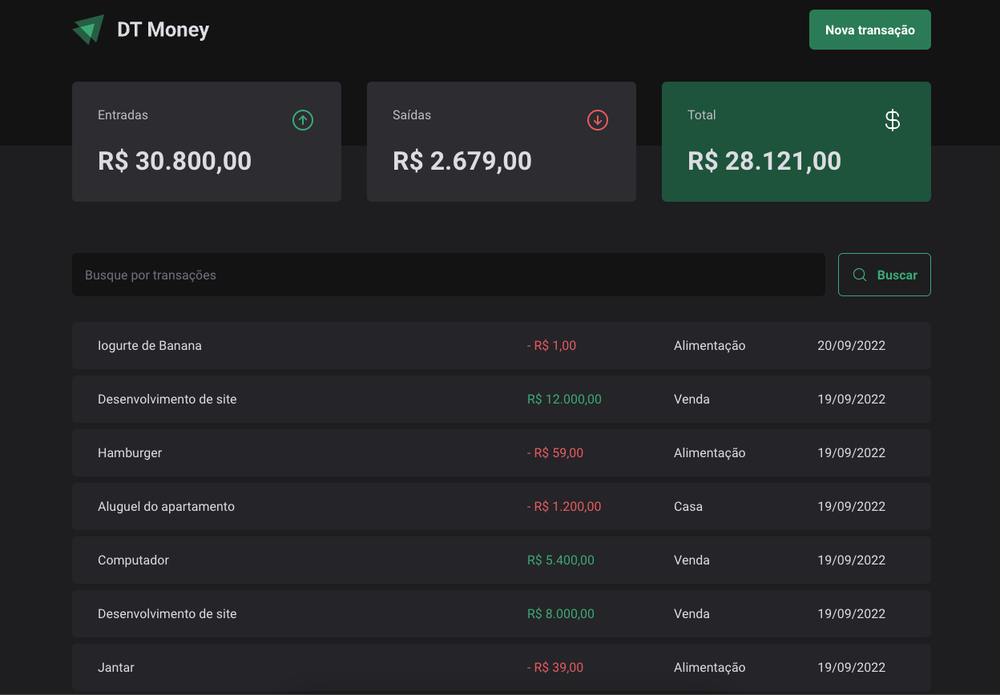

<h1 align="center">
  
</h1>

<h4 align="center">A React + Vite app organize your finances</h4>

<p align="center">
  
  
  
  <a href="https://www.linkedin.com/in/caiotracera/">
    
  </a>
  <br />
  <a href="https://github.com/caiotracera/dt-money-vite/commits/master">
    
  </a>
  <a href="https://github.com/caiotracera/dt-money-vite/issues">
    
  </a>
  
  
</p>

<blockquote align="center">
“What worries you masters you.”
</blockquote>

<p align="center">
  <a href="#rocket-about-the-project">About the project</a>&nbsp;&nbsp;&nbsp;|&nbsp;&nbsp;&nbsp;
  <a href="#man_technologist-technologies">Technologies</a>&nbsp;&nbsp;&nbsp;|&nbsp;&nbsp;&nbsp;
  <a href="#wrench-getting-started">Getting started</a>&nbsp;&nbsp;&nbsp;|&nbsp;&nbsp;&nbsp;
  <a href="#memo-license">License</a>&nbsp;&nbsp;&nbsp;
</p>

<div align="center">
  
</div>

# :rocket: About the project

<b>DTMoney</b> is a simple React with Vite application made for studies. It allows you to organize your finances by adding the what you earn and what you spend.

# :man_technologist: Technologies

- React.JS
- Styled-Components
- Axios
- Vite
- JSON-Server
- Radix UI
- TypeScript
- ESLint
- Prettier

# :wrench: Getting started

In order to run this project, you must have installed <a href="https://nodejs.org/en/">Node.js</a>
and <a href="https://git-scm.com/">Git SCM</a>. If you met all the requirements, follow the instructions:

<b>Clone the project</b>

```shell
$ git clone https://github.com/caiotracera/dt-money-vite
$ cd dt-money-vite
```

<b>Install the dependencies</b>

```shell
$ npm install # Install all dependencies
```

<b>Start the server</b>

```shell
$ npm run dev:server # Starts JSON-server at http://localhost:3333/
```

<b>Start the project</b>

```shell
$ npm run build # Generate the production build
$ npm run preview # Initiate the project at http://127.0.0.1:4173/
```

# :memo: License

Made with :sparkling_heart: by Caio.
<br />
:coffee: Can we have a coffe? <a href="https://www.linkedin.com/in/caiotracera/">Get in touch!</a>
